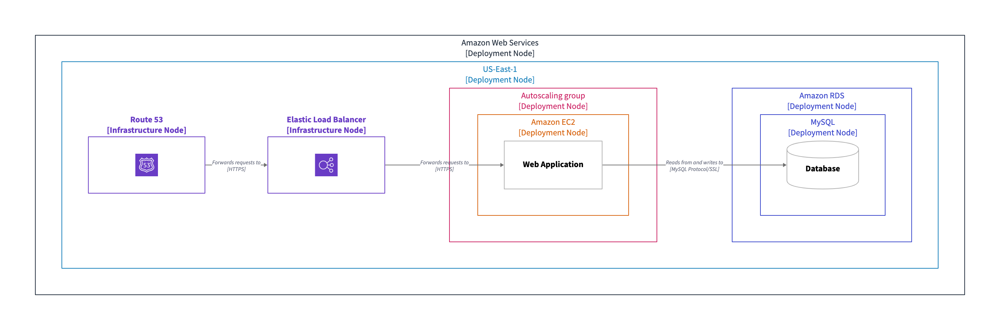

# Structurizr D2 Exporter

The [D2Exporter](lib/src/main/java/com/github/goto1134/structurizr/export/d2/D2Exporter.java) class provides a way 
to export Structurizr views to diagram definitions that are compatible with [D2](https://d2lang.com).

This library is developed to be included in the [Structurizr CLI](https://github.com/structurizr/cli),
and is available on Maven Central, for inclusion in your own Java applications:

- groupId: `io.github.goto1134`
- artifactId: `structurizr-d2-exporter`

## Example

