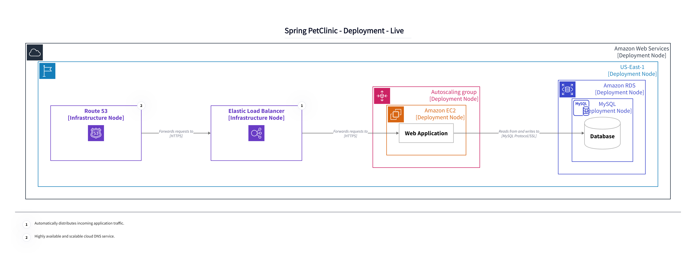

# Structurizr D2 Exporter

The [D2Exporter](/lib/src/main/kotlin/io/github/goto1134/structurizr/export/d2/D2Exporter.kt) class provides a way
to export Structurizr views to diagram definitions that are compatible with [D2](https://d2lang.com).

This library is developed to be included in the [Structurizr CLI](https://github.com/structurizr/cli),
and is available on Maven Central, for inclusion in your own Java applications:

- groupId: `io.github.goto1134`
- artifactId: `structurizr-d2-exporter`

# Table of Content
* [Structurizr D2 Exporter](#structurizr-d2-exporter)
* [Table of Content](#table-of-content)
* [Customization](#customization)
  * [`d2.title_position`](#d2title_position)
  * [`d2.animation`](#d2animation)
  * [`d2.animated`](#d2animated)
  * [`d2.fill_pattern`](#d2fill_pattern)
<!-- TOC -->

# Customization

## `d2.title_position`

* Entity: [`views`, `view`](https://github.com/structurizr/dsl/blob/master/docs/language-reference.md#views)
* Values: `top-left`, `top-center`, `top-right`, `center-left`, `center-right`, `bottom-left`, `bottom-center`, `bottom-right`
* Default: `top-center`

Specifies diagram title position. For more details, see [d2 near](https://d2lang.com/tour/positions/#near).

### Example:

Source: [title-position/workspace.dsl](lib/src/test/resources/title-position/workspace.dsl)

`bottom-left` title:

## `d2.animation`

* Entity: [`views`, `view`](https://github.com/structurizr/dsl/blob/master/docs/language-reference.md#views)
* Values: `d2`, `frames`, `no`
* Default: `d2`

Specifies animation variant for [animated structurizr views](https://github.com/structurizr/dsl/blob/master/docs/language-reference.md#animation).

* `d2` is for [d2 steps animation](https://d2lang.com/tour/steps) that allows you
to produce animated images.
* `frames` is for structurizr default frame animation.
Unfortunately, it is not exportable yet.
* `no` can be used in case you have animation steps, but do not want the animation.

### Example:

## `d2.animated`

* Entity:  [`relationship` style](https://github.com/structurizr/dsl/blob/master/docs/language-reference.md#relationship-style)
* Values: `true`, `false`
* Default: `false`

### Example

Source: [animated-relation/workspace.dsl](lib/src/test/resources/animated-relation/workspace.dsl)

**Hint:** Do not forget to provide [`--animate-interval` flag](https://d2lang.com/tour/composition-formats/) when
producing SVG to see the animation.

## `d2.fill_pattern`
* Entity: [`views`, `view`](https://github.com/structurizr/dsl/blob/master/docs/language-reference.md#views) ,[`element` style](https://github.com/structurizr/dsl/blob/master/docs/language-reference.md#element-style)
* Values: `dots`, `lines`, `grain`
* Default: –

When set on `views` or `view`, adds a [fill pattern](https://d2lang.com/tour/style/#fill-pattern) to the background.
When set on an `element` style, adds [fill pattern](https://d2lang.com/tour/style/#fill-pattern) to its body.

### Example

Source: [fill-pattern/workspace.dsl](lib/src/test/resources/fill-pattern/workspace.dsl)

